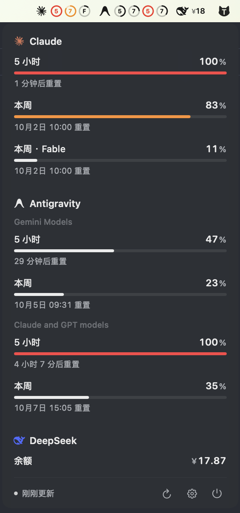

<div align="center">

# Tidy Usage

**轻量、克制、原生的 macOS 菜单栏 AI 额度看板**

<p>
  
  
  
  
</p>

</div>

<br>

<div align="center">
  
</div>

<br>

在 macOS 菜单栏常驻显示 Claude、Antigravity (Gemini) 等 AI 平台的 5 小时 / 每周用量消耗。拒绝臃肿进程，只为抬头一瞥即知余量。

<div align="center">
  
</div>

---

## 特性

- **菜单栏环形进度** — Logo 后面跟 `5`（5 小时窗口）和 `7`（7 天窗口）两个圆环，填充比例即已用百分比。≥ 80% 橙色预警，≥ 90% 红色警示，常态下单色融入系统深浅色菜单栏。
- **点击即时钉选** — 面板中点击任意行即可将该指标钉上 / 撤下菜单栏，未钉选行半透明弱化。未钉选任何指标时显示 `gauge.with.needle` 空状态。
- **原生毛玻璃面板** — 无边框 `NSPanel`，锚定菜单栏图标位置，菜单栏宽度变化不跳动。进度条下方显示自适应重置倒计时（< 24h 显示"X 小时 Y 分后重置"，≥ 24h 显示日期时间）。
- **零凭据风险** — 客户端仅向自建只读聚合端拉取脱敏数据，Token 存入 macOS Keychain。
- **429 容灾** — 上游 429 时保持上次成功数据，服务商不会闪退消失。磁盘持久化缓存，冷启动即刻展示历史用量。缺失服务商 30 秒后自动补拉。
- **防抖交互** — 刷新按钮整圈旋转不卡半截，所有操作全面防抖节流。

---

## 快速上手

```bash
git clone https://github.com/RUIIIOVO/tidy-usage-sidebar.git
cd tidy-usage-sidebar

# 可选：配置 HTTP 例外域名
cp local.env.example local.env

# 编译 + 签名 + 安装至 ~/Applications 并启动
scripts/build.sh
```

首次启动后点击菜单栏图标 → 底部 ⚙️ 设置 → 填入自建查询接口地址和 Token → 保存并测试。

> 构建脚本自动检测 `Apple Development` 证书，无证书时回退 ad-hoc 签名。`local.env` 中配置 `HTTP_HOST` 可为指定域名打入 ATS 例外。

---

## 接口规范

客户端向自建端点发送请求：

```
GET /usage
Authorization: Bearer <TOKEN>
```

期望返回：

```json
{
  "ok": true,
  "windows": [
    {
      "provider": "claude",
      "name": "five_hour",
      "label": null,
      "utilization": 28.5,
      "resets_at": "2026-09-30T09:30:00Z"
    },
    {
      "provider": "antigravity",
      "name": "weekly",
      "label": "Gemini Models",
      "utilization": 92.4,
      "resets_at": "2026-10-01T12:00:00Z"
    }
  ],
  "queried_at": 1790734952
}
```

| 字段 | 说明 |
|------|------|
| `provider` | `claude` / `antigravity`，其他值降级为文本图标 |
| `name` | 含 `5h` / `five_hour` → 5 小时窗口；`weekly` / `seven_day` → 周窗口 |
| `label` | 子模型标签，如 `Fable`（菜单栏环上显示首字母 `F`） |
| `utilization` | 已用百分比 0.0–100.0 |
| `resets_at` | ISO 8601 格式额度刷新时间 |

配套服务端参考实现见 [`server/`](server/) 目录。

---

## 项目结构

```
App/Sources/TidyUsage/
├── App.swift             # 状态栏生命周期与事件分发
├── MenuBarIcon.swift     # 菜单栏渲染（环形进度、预警着色、空状态）
├── PanelWindow.swift     # 无边框原生毛玻璃 NSPanel
├── PanelView.swift       # 交互看板（进度条、倒计时、钉选）
├── SettingsView.swift    # 设置窗口（Keychain 读写）
├── UsageStore.swift      # 轮询调度、429 容灾、磁盘缓存
├── Models.swift          # 数据模型与时间格式化
├── Debounce.swift        # 节流防抖
├── LogoPaths.swift       # 矢量 Logo 数据
└── SVGPath.swift         # 轻量矢量路径渲染
server/                   # Python 额度中继服务
scripts/build.sh          # 编译签名安装脚本
```

---

## 许可

[MIT](LICENSE)

Logo 版权：Claude 徽标取自 [Simple Icons](https://simpleicons.org) (CC0)，Antigravity 徽标取自 [Lobe Icons](https://github.com/lobehub/lobe-icons) (MIT)，商标归各自所有者。
