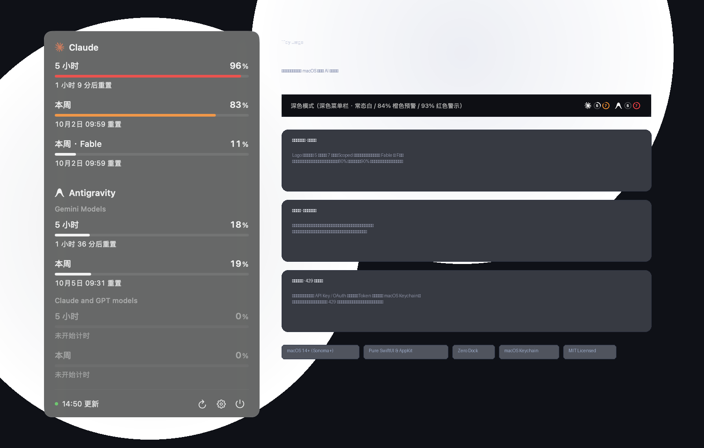
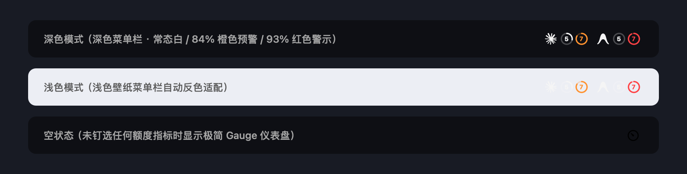

<div align="center">

# Tidy Usage

<p align="center">
  <strong>轻量、克制、原生的 macOS 菜单栏 AI 订阅额度看板</strong>
</p>

<p align="center">
  
  
  
  
  
</p>

<br />



</div>

<br />

**Tidy Usage** 专为多模型订阅用户打造。它在 macOS 菜单栏常驻显示各个 AI 平台（如 Claude、Antigravity / Gemini 等）的 **5 小时与每周用量消耗**。拒绝花哨冗余与臃肿进程，只为「抬头一瞥即知余量，点击展开优雅掌控」。

---

## ✨ 特性一览

### 1. 极简菜单栏排布 · 一瞥即知
- **Logo + 环形进度**：每个服务商紧跟 `5`（5 小时滑动窗口）和 `7`（7 天周窗口）圆环；分模型的周额度自动提取首字母（如 Fable → `F`）。
- **纯粹的消耗比例**：圆环描边直观代表**已用百分比**（0%~100%）。
- **双阈值警示色**：
  - **常态（< 80%）**：纯白/深灰单色，完美融入系统深浅色菜单栏。
  - **高负荷（≥ 80%）**：切换为**鲜亮橙色**。
  - **极限告警（≥ 90%）**：切换为**醒目红色**。
- **优雅空状态**：若未钉选任何指标，菜单栏自动显示小巧的 SF Symbol 仪表盘（`gauge.with.needle`），随时随地可点开面板。

### 2. 原生下拉看板 · 点击即时钉选
- **沉浸毛玻璃窗口**：自定义无边框 `NSPanel`，打开瞬间锚定菜单栏图标位置，无论菜单栏宽度怎么变动均绝不跳动移位。
- **点击行直接钉选**：在面板中轻点任意行，即可立即将该指标钉上或撤下菜单栏，免去繁琐设置；未钉选的行以优雅半透明弱化显示。
- **更具可读性的重置时间**：
  - 进度条位于数值正下方。
  - **24 小时以内**：直观倒计时（如 `2 小时 19 分后重置`、`45 分钟后重置`）。
  - **大于 24 小时**：自然日期时间（如 `10月2日 10:00 重置`）。
- **细腻交互防抖**：
  - 刷新按钮点击后保证**完整转满整圈**（0.7s 先加速后减速），绝不卡顿半截。
  - 刷新、钉选、设置、退出全面集成防抖节流，杜绝快速连击导致的无效并发。

### 3. 本地零凭据风险 · 429 容灾兜底
- **客户端零隐私触碰**：App 不读取本机任何本地 OAuth Token 或配置，仅向你自建的只读聚合端拉取脱敏数据。
- **系统级安全存储**：API 访问 Token 经硬件级安全存储写入 **macOS Keychain**。
- **429 自动容灾兜底**：
  - 遭遇官方上游接口短暂 429（Rate Limit）时，自动保持上一轮成功数据，**服务商绝不会在面板或菜单栏中偶发闪退消失**。
  - 本地持久化缓存：关机或冷启动也能即刻展示上次用量；单服务商离线后 30 秒后台轻量级自动补拉。

---

## 🖼️ 界面展示

### 菜单栏样式对照



| 状态 | 表现形式 | 说明 |
| :--- | :--- | :--- |
| **深色菜单栏** | 白色前景色 + 状态预警 | 无缝适配原生 Dark Mode；用量达 80% 变橙，90% 变红 |
| **浅色菜单栏** | 自动反色 + 状态预警 | 切换浅色壁纸时自动调整为深灰前景色，保持极高可读性 |
| **未钉选指标** | `gauge.with.needle` | 干净克制，点击即可唤出面板进行快捷钉选 |
| **异常/报错** | 仪表盘右上角橙点 | 网络不可达或 Token 失效时，静默轻度提示，不打扰工作流 |

---

## 🚀 快速上手

### 环境要求
- **操作系统**：macOS 14.0 (Sonoma) 或更高版本
- **编译工具**：Command Line Tools 或 Xcode 15+（内置 Swift 5.9+）

### 一键构建与安装

克隆仓库并执行内置构建脚本，无需打开庞大的 Xcode 工程：

```bash
git clone https://github.com/RUIIIOVO/tidy-usage-sidebar.git
cd tidy-usage-sidebar

# 1. 复制本地环境变量（可选配置纯 HTTP 例外、默认端点等）
cp local.env.example local.env

# 2. 编译、签名并安装至 ~/Applications，同时立即启动
scripts/build.sh
```

> **提示**：
> - 构建脚本会自动检测本机 `Apple Development` 签名证书；若无证书则自动回退至 ad-hoc 签名。
> - 如果额度服务部署在内网且走纯 HTTP 协议，在 `local.env` 中配置 `HTTP_HOST=<你的IP或域名>`，构建脚本会自动且仅为该域名打入 ATS 例外。
> - 若只需生成编译产物而不安置，可执行 `scripts/build.sh --no-install`（产物位于 `build/Tidy Usage.app`）。

### 首次配置

首次启动后，点击菜单栏上的图标打开面板，点击底部右下角的 **⚙️（设置）**：
1. 填入你的自建查询接口地址（`Endpoint URL`）。
2. 填入服务验证口令（`Token`），保存后自动存入 macOS Keychain。
3. 点击 **保存并测试**，连接成功即刻开始轮询。

---

## 📡 接口与数据规范

Tidy Usage 客户端设计为**通用、无状态**的轻量看板。你只需搭建一个提供标准 JSON 的只读端点：

### 请求方式
```http
GET /usage HTTP/1.1
Host: your-api-server:8318
Authorization: Bearer <YOUR_TOKEN>
```

### 响应协议示例
```json
{
  "ok": true,
  "windows": [
    {
      "provider": "claude",
      "name": "five_hour",
      "label": null,
      "utilization": 28.5,
      "resets_at": "2026-09-30T09:30:00Z"
    },
    {
      "provider": "claude",
      "name": "seven_day",
      "label": null,
      "utilization": 84.0,
      "resets_at": "2026-10-02T15:00:00Z"
    },
    {
      "provider": "claude",
      "name": "weekly_scoped",
      "label": "Fable",
      "utilization": 15.0,
      "resets_at": "2026-10-05T00:00:00Z"
    },
    {
      "provider": "antigravity",
      "name": "5h",
      "label": "Gemini Models",
      "utilization": 0.0,
      "resets_at": null
    },
    {
      "provider": "antigravity",
      "name": "weekly",
      "label": "Gemini Models",
      "utilization": 92.4,
      "resets_at": "2026-10-01T12:00:00Z"
    }
  ],
  "queried_at": 1790734952
}
```

### 字段说明
- `windows[].provider`：服务商标示，目前内置识别 `claude` 与 `antigravity`，其他未知服务商自动降级为通用文本图标。
- `windows[].name`：时间窗口标识（包含 `5h` / `five_hour` 自动识别为 5 小时滑动窗口；`weekly` / `seven_day` 识别为每周窗口）。
- `windows[].label`：子模型/分组标签（例如 `Gemini Models`、`Claude and GPT Models`、`Fable` 等）。
- `windows[].utilization`：**已用百分比**（0.0 ~ 100.0），支持小数。
- `windows[].resets_at`：ISO 8601 格式的额度刷新时间（UTC 或带时区字符串）。

> 💡 **配套服务端**：仓库的 [`server/`](server/) 目录下提供了基于 Python 的轻量实现，专用于读取 [CLIProxyAPI](https://github.com/router-for-me/CLIProxyAPI) 认证凭据并旁路聚合官方用量。详细部署配置说明见 [server/README.md](server/README.md)。

---

## 📂 项目结构

```text
tidy-usage-sidebar/
├── App/                         # 客户端主源码
│   └── Sources/TidyUsage/
│       ├── App.swift            # 状态栏生命周期、Menu Extra 代理与事件分发
│       ├── MenuBarIcon.swift    # 菜单栏动态渲染（环形进度、预警着色、空状态仪表盘）
│       ├── PanelWindow.swift    # 自定义无边框原生毛玻璃 NSPanel（防跳动锚定）
│       ├── PanelView.swift      # 交互看板界面（自适应倒计时、平滑进度条、防抖按钮）
│       ├── SettingsView.swift   # 配置窗口（Keychain 读写与连通性验证）
│       ├── Debounce.swift       # 节流防抖核心工具
│       ├── Models.swift         # 数据模型、持久化落盘与时间格式化
│       ├── UsageStore.swift     # 状态机：轮询调度、单模型 429 容灾兜底、补拉策略
│       ├── LogoPaths.swift      # 矢量高精 SVG 图标数据（Claude、Antigravity）
│       └── SVGPath.swift        # 轻量级原生矢量路径渲染器
├── server/                      # 额度中继服务（Python + systemd）
│   ├── usage_api.py             # 旁路用量抓取聚合服务
│   ├── cpa-usage.service        # Linux systemd 守护进程单元
│   └── README.md                # 服务端详细部署与运维指南
├── scripts/
│   └── build.sh                 # 自动化编译、ATS 打包、签名与安装脚本
├── docs/images/                 # 规范化文档展示图与高清预览图
├── design/                      # UI 迭代原型与 HTML 静态设计稿
└── local.env.example            # 本地敏感环境配置模板
```

---

## 🔒 隐私与许可

- **数据隐私**：所有统计数据均直接在客户端与你配置的自建服务器之间传输，不经过任何第三方云端中转，源码完全公开透明。
- **开源许可证**：本项目基于 [MIT 许可证](LICENSE) 发布。
- **徽标版权**：Claude 徽标取自 [Simple Icons](https://simpleicons.org) (CC0)；Antigravity 徽标取自 [Lobe Icons](https://github.com/lobehub/lobe-icons) (MIT)；商标版权归其各自母公司或组织所有。
